# Bootcamp School Database — The Bridge

Base de datos relacional PostgreSQL construida a partir de datos planos de estudiantes y claustro de un bootcamp. El esquema está normalizado para soportar múltiples campus, verticales, promociones y modalidades.

## Modelo relacional



El diagrama interactivo está disponible en [TheBridgeERD.html](TheBridgeERD.html).

### Tablas

| Tabla | Descripción |
|---|---|
| `campus` | Sedes (Madrid, Valencia, …) |
| `vertical` | Itinerarios formativos (DS, FS, …) |
| `promocion` | Cohortes por fecha de inicio (Septiembre, Febrero, …) |
| `modalidad` | Formato de clase (Presencial, Online) |
| `rol` | Rol del profesor (TA, LI) |
| `proyecto_tipo` | Tipos de proyecto evaluable por vertical |
| `grupo` | Combinación única campus + vertical + promoción |
| `estudiante` | Alumnos, asignados a un grupo |
| `calificacion` | Resultado por estudiante y tipo de proyecto |
| `profesor` | Profesores del claustro |
| `profesor_grupo` | Asignación de profesores a grupos con modalidad |

## Estructura del repositorio

```
.
├── notebooks/
│   └── generate_inserts.ipynb   # Procesa los CSV brutos y genera los INSERT
├── sql/
│   ├── 01_create_tables.sql     # DDL — creación de tablas
│   ├── 02_insert_data.sql       # DML — inserción de datos
│   └── 03_queries_demo.sql      # Queries de demostración
├── src/
│   └── datos_brutos/            # CSV originales (clase_1..4, claustro)
├── TheBridge_modelo_relacional.svg
└── TheBridgeERD.html
```

## Cómo usar

### 1. Generar los INSERT (opcional)

Si necesitas regenerar `02_insert_data.sql` desde los CSV originales, ejecuta todas las celdas del notebook `notebooks/generate_inserts.ipynb`. La última celda imprime los bloques `INSERT` listos para copiar.

### 2. Crear la base de datos

```sql
-- En psql o cualquier cliente PostgreSQL:
\i sql/01_create_tables.sql
\i sql/02_insert_data.sql
```

### 3. Queries de demo

```sql
\i sql/03_queries_demo.sql
```

Las queries cubren: listado de estudiantes, conteo por grupo, tasa de aprobación por proyecto, estudiantes con todos los proyectos aprobados, ranking de suspensos y asignaciones de profesores.
