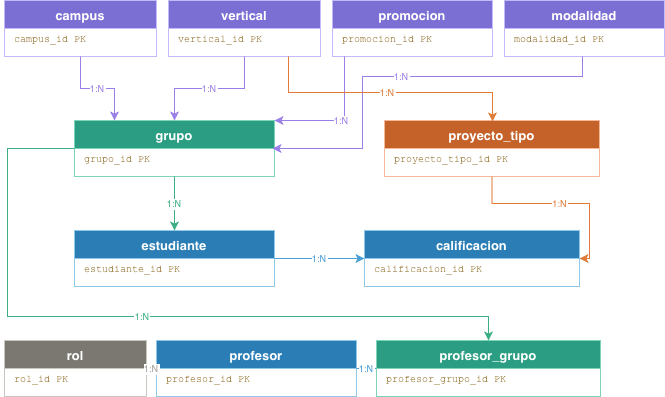
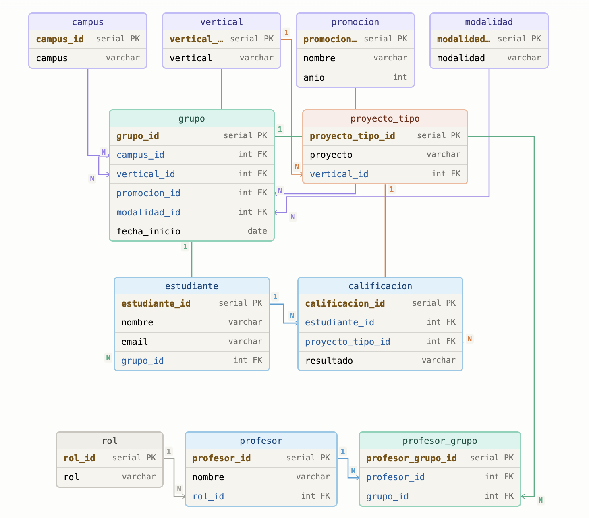

# Bootcamp School Database — The Bridge

Base de datos relacional PostgreSQL diseñada y construida a partir de datos planos de estudiantes y claustro de un bootcamp. El esquema está normalizado para soportar múltiples campus, verticales, promociones y modalidades, con capacidad de escalar sin cambios estructurales.

## Modelos

**Modelo relacional**



**Modelo lógico**




### Tablas

| Tabla | Descripción |
|---|---|
| `campus` | Sedes (Madrid, Valencia, …) |
| `vertical` | Itinerarios formativos (DS, FS, …) |
| `promocion` | Cohortes por convocatoria (Septiembre, Febrero, …) |
| `modalidad` | Formato de clase (Presencial, Online) |
| `rol` | Rol del profesor (TA, LI) |
| `proyecto_tipo` | Tipos de proyecto evaluable, ligados a una vertical |
| `grupo` | Combinación única campus + vertical + promoción |
| `estudiante` | Alumnos asignados a un grupo |
| `calificacion` | Resultado (Apto / No Apto) por estudiante y tipo de proyecto |
| `profesor` | Profesores del claustro |
| `profesor_grupo` | Asignación de profesores a grupos con modalidad |

## Estructura del repositorio

```
.
├── notebooks/
│   └── generate_inserts.ipynb   # Procesa los CSV brutos y genera los INSERT
├── sql/
│   ├── 01_create_tables.sql     # DDL — creación de tablas y restricciones
│   ├── 02_insert_data.sql       # DML — inserción de datos
│   └── 03_queries_demo.sql      # 8 queries de demostración
├── src/
│   └── datos_brutos/            # CSV originales (clase_1..4, claustro)
├── TheBridge_modelo_relacional.svg
└── TheBridgeERD.html
```

## Cómo usar

### 1. Generar los INSERT (opcional)

Si necesitas regenerar `02_insert_data.sql` desde los CSV originales, ejecuta todas las celdas del notebook `notebooks/generate_inserts.ipynb`. La última celda imprime los bloques `INSERT` listos para copiar.

### 2. Crear la base de datos

```sql
-- En psql o cualquier cliente PostgreSQL:
\i sql/01_create_tables.sql
\i sql/02_insert_data.sql
```

### 3. Queries de demo

```sql
\i sql/03_queries_demo.sql
```

Las 8 queries cubren:

| # | Consulta |
|---|---|
| Q1 | Listado completo de estudiantes con campus, vertical y promoción |
| Q2 | Número de estudiantes por campus, vertical y promoción |
| Q3 | Tasa de aprobación por tipo de proyectos y vertical |
| Q4 | Estudiantes que aprobaron todos sus proyectos |
| Q5 | Ranking de estudiantes por número de proyectos suspendidos |
| Q6 | Detalle de calificaciones por estudiante |
| Q7 | Grupos con sus profesores TA y LI asignados |
| Q8 | Número de alumnos convertidos en profesore |
| Q9 | Listado de todas las tablas del entorno de trabajo|

## Decisiones de diseño

- **`proyecto_tipo` ligado a `vertical`**: cada vertical tiene su propio catálogo de proyectos (DS tiene EDA, ML… ; FS tiene los suyos), evitando mezclas entre itinerarios.
- **`grupo` como entidad central**: la combinación `(campus, vertical, promocion)` con restricción `UNIQUE` garantiza que no existan duplicados y centraliza las FK de `estudiante` y `profesor_grupo`.
- **`calificacion` desacoplada**: almacena un resultado por par `(estudiante, proyecto_tipo)`, permitiendo añadir nuevos tipos de proyecto sin tocar el resto del esquema.
- **Escalabilidad**: añadir un campus, vertical, promoción o modalidad nueva solo requiere un `INSERT` en la tabla de catálogo correspondiente, sin modificar el esquema.
